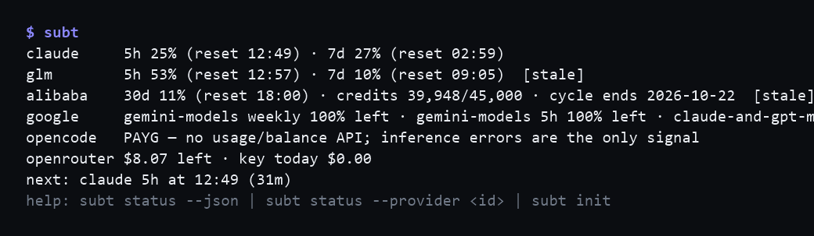
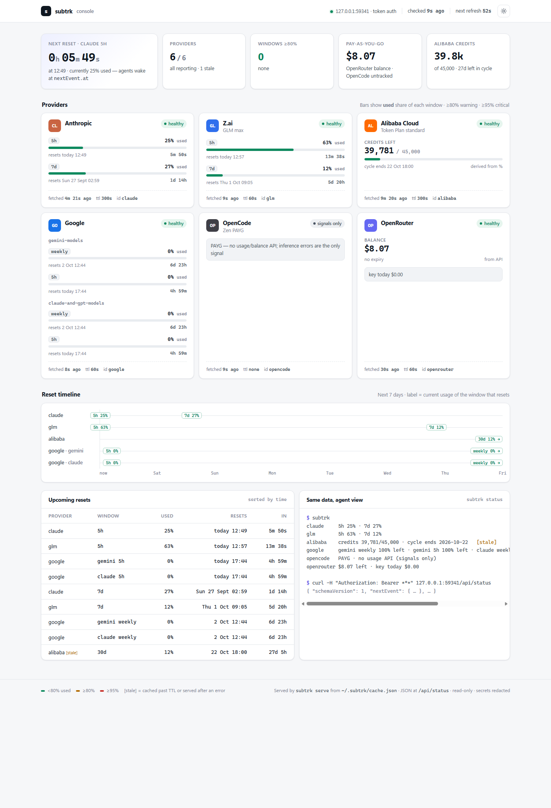

# subtrk

**AI subscription quotas in one command.** `subtrk` reports remaining usage for
the plans its contributors use – today Claude Pro, Z.ai GLM Coding Plan, Alibaba
Cloud Model Studio, Google AI Pro, OpenCode Zen and OpenRouter – in one compact
view, designed first for the AI agents that work for you and second for you.
Coverage expands as needs or requests come in: adding a provider is a contained
change (see the [implementation guide](docs/implementation-plan.md)), and PRs
adding providers are welcome.

Agents stop hitting brick walls at rate limits: `subtrk status --json` gives every
window's usage and reset time plus a computed `nextEvent`, so an agent can schedule a
wake-up at the reset instead of dying. Humans stop keeping a browser tab open per
provider.

```text
$ subtrk
claude     5h 13% (reset 18:04) · 7d 89% !
glm        5h 4% (reset 19:47) · 7d 61%
alibaba    credits 31,240/45,000 · cycle ends 2026-10-12
google     5h 62% left · 7d 81% left   [stale]
opencode   PAYG · no usage API (signals only)
openrouter $74.75 left · key today $1.20
next: claude 5h at 18:09 (4h 49m)
help: subtrk status --json | subtrk status --provider <id> | subtrk init
```



## Web console

```bash
subtrk serve
```

Starts the dashboard on a random `127.0.0.1` port and prints the URL to open –
one page for every tracked provider: usage bars per window (with ≥80%/≥95% warning
levels), credit pools, a 7-day reset timeline, upcoming resets, and the same
agent view the CLI prints, auto-refreshing on the cache heartbeat. When a
provider's error says it is refreshable, its card shows a **Refresh now** button
that re-runs that provider's own refresh action on the host.



The server is loopback-only, requires a per-run token (delivered in the printed
URL), never emits CORS headers, and serves read-only JSON – see
[`docs/spec.md`](docs/spec.md) §`subtrk serve` for the security design.

## Why

Modern AI workstations juggle several subscriptions with different windows (5-hour,
weekly, monthly credit pools) and different dashboards. Without a combined view you
over-plan, under-use, and your agents discover limits by crashing into them. `subtrk`
reads each vendor's usage the same way their own CLIs do, normalizes it, caches it
politely, and speaks both human and agent.

## Design principles

- **Agents first** – follows the [AXI principles](https://axi.md): token-efficient
  output, pre-computed aggregates (`nextEvent`, `recheckAfter`), structured errors
  you branch on by kind (never by message text), exit codes with meaning, no
  interactive traps in agent paths, content before help.
- **Zero runtime dependencies** – TypeScript executed directly by Node ≥22.18
  (type stripping). No build step; the dev toolchain (typecheck, linter) is
  dev-only and never ships.
- **Polite by construction** – one shared TTL cache (`~/.subtrk/cache.json`) with
  stale-while-revalidate and a hard 300s floor on the one endpoint known to punish
  polling. Six agents checking simultaneously produce one upstream request.
- **Fail soft, per provider** – one broken endpoint never breaks the others; errors
  carry a `kind` and a `hint`, and stale cached numbers beat a wall of text.
- **Secrets stay put** – reads the credential files your CLIs already maintain
  (read-only), stores its own keys in `~/.subtrk/env` (never global env vars), and
  mechanically redacts every secret from every output. The cache contains no secrets.

## Install

Requires Node ≥22.18.

No install needed – every command runs through npx:

```bash
npx subtrk init     # one-time interactive setup
npx subtrk serve    # web console
npx subtrk auth refresh --provider <id>   # re-authorise one provider (e.g. alibaba or google)
npx subtrk          # same as: npx subtrk status
```

Or install globally:

```bash
npm install -g subtrk
subtrk init       # one-time interactive setup
```

From source (development):

```bash
git clone https://github.com/ChaosChild/subtrk.git
cd subtrk
npm install       # dev-only toolchain
npm link          # puts `subtrk` on PATH (subtrk.cmd on Windows)
```

`subtrk init` first asks which providers you track – a numbered listing answered
with numbers and/or ids (e.g. `1 3 5` or `claude, google`) – and stores the
selection in `~/.subtrk/config.json`; the checks below then only cover those.
Edit the file or re-run `subtrk init` to change the selection, delete it to
track all six again. It runs the Alibaba login flow (`bl auth login --api-key` +
`--console` browser login), prompts for OpenRouter keys (hidden input, saved to
`~/.subtrk/env`), and verifies each provider honestly – `[ok]` only when a
credential actually works.

## Providers

| Provider | Plan | Reads | Windows | Status |
|---|---|---|---|---|
| Anthropic | Claude Pro (personal) | `api.anthropic.com/api/oauth/usage` via the OAuth token Claude Code already stores | 5h + 7d | reverse-engineered, de-facto standard |
| Z.ai | GLM Coding Plan | the same monitor endpoint ZCode itself uses | 5h + weekly | unofficial, officially plugin-endorsed |
| Alibaba Cloud | Model Studio Token Plan (intl) | official `bl` CLI raw gateway passthrough (`bl console call`) | 30-day credits pool (monthly-only since 2026-09-22) | official (via bl) |
| Google | AI Pro (personal) | agy's Credential Manager token → Code Assist quota summary (body `{}`, UA `antigravity`); read-only self-refresh | per-family 5h/7d (gemini + claude-and-gpt families) | best-effort – degrades to `agy /usage` |
| OpenCode | Zen pay-as-you-go | no usage/balance API exists for PAYG | – | signals only (honest note) |
| OpenRouter | pay-as-you-go | `/api/v1/key` (+ `/api/v1/credits` with a management key) | – | official |

None of these vendors officially supports third-party quota readers except Alibaba
and OpenRouter; the others are the same calls their own CLIs make, and can change.
`subtrk` isolates that churn in small per-provider modules and degrades cleanly.
These are the providers the contributors use today – the set grows as needs or
requests come in, and additions are welcome as PRs (the
[implementation guide](docs/implementation-plan.md) walks through it).

## For agents

```bash
subtrk status --json
```

- `providers[].windows[].resetsAt` – ISO-8601 UTC reset instants.
- `nextEvent.at` – the earliest time new information can exist
  (`max(resetsAt, fetchedAt + ttl)`); schedule the wake-up there.
- `recheckAfter` – heartbeat when no `nextEvent` applies.
- `providers[].error.kind` – branch on it: `no-credentials`, `expired-token`,
  `tool-missing`, `rate-limited`, `forbidden`, `not-readable-remotely`,
  `parse-failure`, `subprocess-failed`, `timeout`, `http-error`.
- `providers[].error.remedy` – exact CLI line to run when present;
  `refreshable: true` on a failed provider means `subtrk auth refresh
  --provider <id>` can re-authorise it.
- Exit codes: `0` ran (per-provider errors are in the output) · `1` CLI/runtime
  failure · `2` usage error · `3` `--strict` violation.
- On Windows, spawn `subtrk.cmd` (or use `shell: true`) – there is no bare `.exe`.

A ZCode/Claude Code-style harness can check before a large task and, at ≥95% of a
window, schedule a wake-up at `nextEvent.at` and continue on another provider in the
meantime – no intervention needed.

## Configuration

- `~/.subtrk/config.json` – `{ "enabled": ["claude", "glm", ...] }` (absent = all).
- `~/.subtrk/env` – `OPENROUTER_API_KEY`, `OPENROUTER_MANAGEMENT_KEY`, optional
  `OPENCODE_API_KEY` (dotenv format; process env wins). Written by `subtrk init`.
- Everything else is read from the credential files your CLIs already own:
  `~/.claude/.credentials.json`, `~/.zcode/cli/config.json`, `~/.gemini/*`,
  `~/.local/share/opencode/auth.json`, `bl`'s own store.

## Security notes

- `subtrk` is read-only towards vendors in its status probes; the one
  deliberate exception is `subtrk auth refresh` (D9), which re-runs a
  provider's own interactive login when asked.
- Secrets are mechanically redacted from all output; the cache stores normalized
  quota data only. See `docs/spec.md` §Redaction.
- `~/.subtrk/env` holds plaintext keys inside your user profile – the same trust
  envelope as the vendor credential files it reads. Design decisions and known
  trade-offs are tracked in `docs/decisions.md`.

## Documentation

- [`docs/spec.md`](docs/spec.md) – full CLI specification (output contract, cache,
  provider integrations, `subtrk init`).
- [`docs/decisions.md`](docs/decisions.md) – design decisions D1–D9 with rationale.
- [`docs/implementation-plan.md`](docs/implementation-plan.md) – implementation
  guide: layout, coding rules, how to add a provider.
- [`docs/phases.md`](docs/phases.md) – roadmap (web console done; M3 analytics
  next; parked).

## License

MIT
